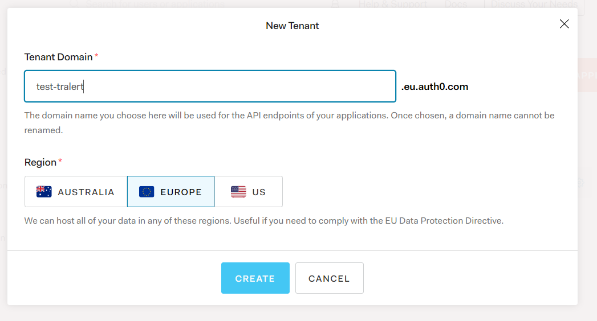
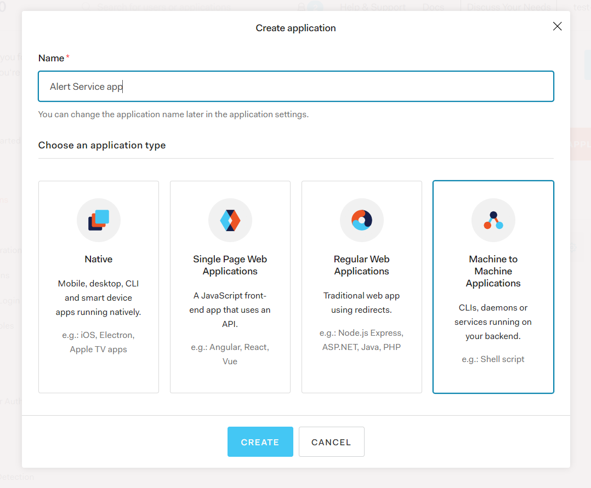
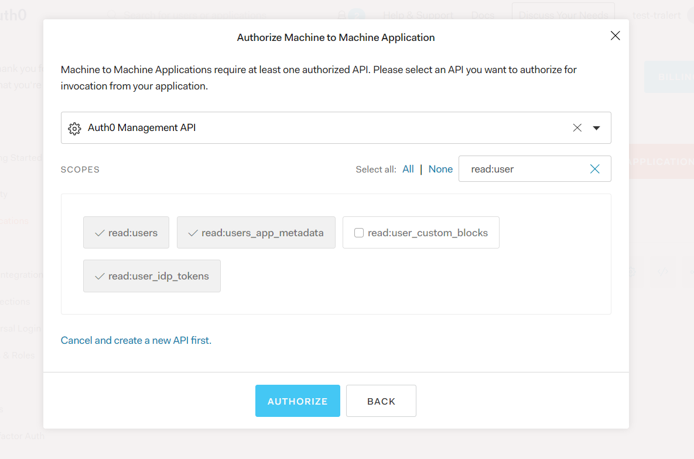
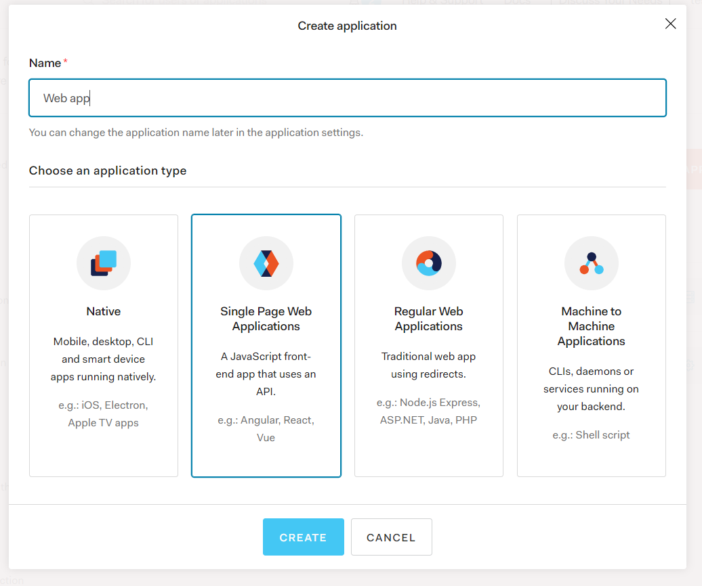
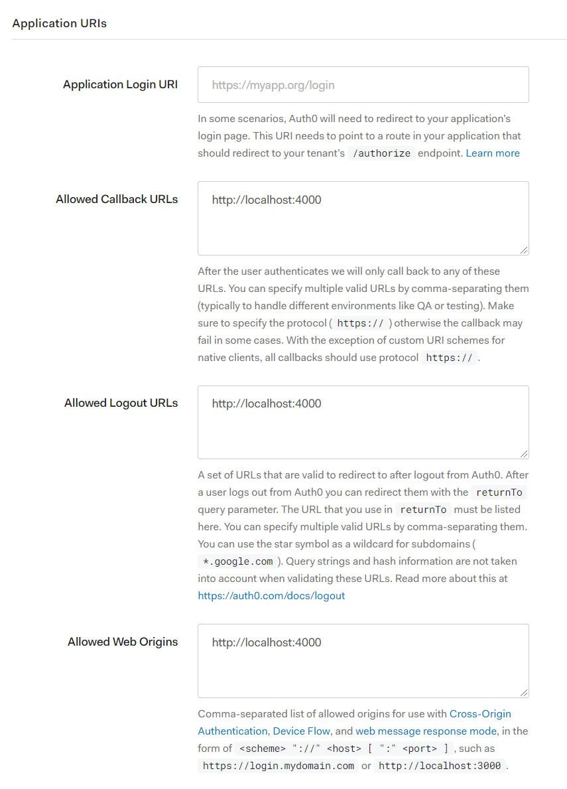
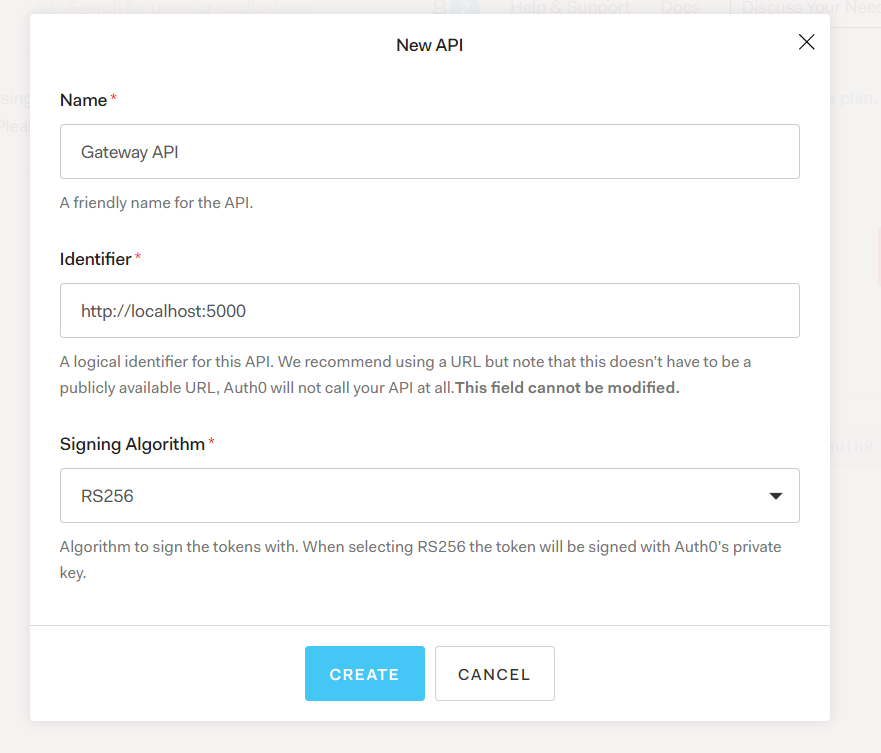

# Authentication/Authorization

On this document you can find how to configure Auth0 for the different services. This configuration is mainly for development, but it should be easy to reuse this for production.

First of all, you'll need to create a new tenant on your Auth0 account.

## Alert service

1.  On the Applications screen, click on `CREATE APPLICATION` button

2.  A new modal should be opened, give whatever name you prefer to your app and select `Machine to Machine Applications`, then click on `Create`

    

3.  On the next step, select api `Auth0 Management API` and select the same scopes as they are on the screenshot

    

If you go to the new created app you'll find the values for the required env variables of the service

-   `AUTH0_DOMAIN`
-   `AUTH0_CLIENT_ID`
-   `AUTH0_CLIENT_SECRET`

## Web app

1.  On the Applications screen, click on `CREATE APPLICATION` button

2.  Put a name and select `Single Page Web Applications`

    

3.  Then, under the settings tab, add the display configuration in the below screenshot. Take into account that configuration is to work locally, you can add different parameters in case you work with any other type of environment

    

Once that is done you can copy the domain and client ID values from the newly app and paste them on to the env configuration variables:

-   `REACT_APP_AUTH0_DOMAIN`
-   `REACT_APP_AUTH0_CLIENT_ID`

## Gateway service

1.  On the APIs screen, click on `CREATE API` button
2.  Write a name for the API, set an identifier and leave the signing algorithm as is, then create the API

    

After this you are ready to set these env variables for the Gateway service:

-   AUTH0_DOMAIN
-   AUTH0_AUDIENCE
